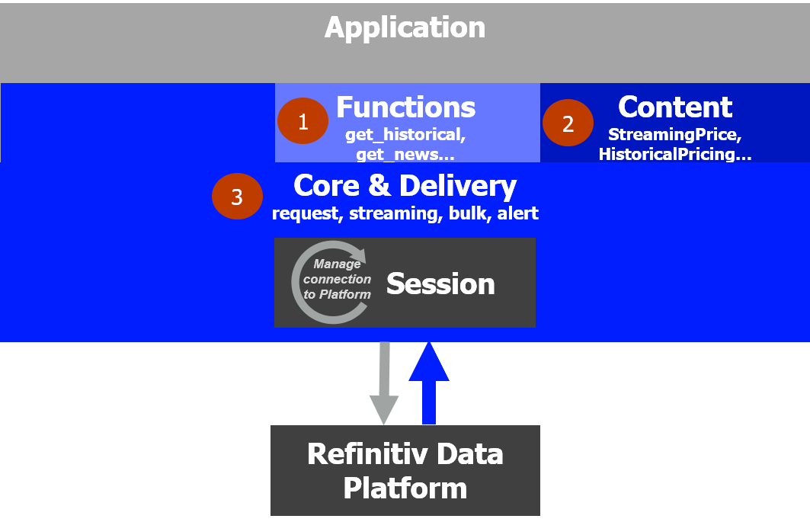

# Comparison of RDP Libraries for Python VS Python/requests direct call for Refinitiv Data Platform
- version: 1.0
- Last update: July 2020
- Environment: Windows
- Compiler: Python
- Prerequisite: [Access to RDP credentials](#prerequisite)

## Introduction

The [Refinitiv Data Platform (RDP) APIs](https://developers.refinitiv.com/refinitiv-data-platform/refinitiv-data-platform-apis) provide various Refinitiv data and content for developers via easy to use Web base API. The consumers which are data scientist, financial coder or trader can use any programming languages that support HTTP request-response and JSON message to retrieve content from RDP in a straightforward way. An example use case are data scientists or trader use [Python language](https://www.python.org/) with the [requests library](https://requests.readthedocs.io/en/master/) to get data from RDP and visualize that data in [Jupyter Notebook](https://jupyter.org/) application.

The [Refinitiv Data Platform Libraries](https://developers.refinitiv.com/refinitiv-data-platform/refinitiv-data-platform-libraries) are ease-of-use APIs defining a set of uniform interfaces providing the developer access to the Refinitiv Data Platform. It simplify the API interface that even easier than using RDP APIs with Python and requests library directly. 

This article demonstrates how easy developers can get Refinitiv content via RDP Libraries by comparing the application source code using RDP Libraries ```PlatformSession ``` versus the code using Python/requests to get the same data. The comparison also can be applied to developers who use other Python HTTP libraries such as [http.client](https://docs.python.org/3.7/library/http.client.html#module-http.client) or [urllib.request](https://docs.python.org/3.7/library/urllib.request.html#module-urllib.request).

Note: This article is focusing on **the comparison of how to get data** only. The reason is once the application receives data from either direct RDP APIs call or RDP Libraries, the data processing or visualize logic are the same.

## <a id="rdp_libs"></a>What is Refinitiv Data Platform (RDP) Libraries?

Refinitiv provides wide range of contents and data which require multiple technologies, delivery mechanisms, data formats and also the multiple APIs to access each content. The RDP Libraries are suite of ease-of-use interfaces providing unified access to streaming and non-streaming data services offered within the Refinitiv Data Platform (RDP). The Libraries simplified how to access data to various delivery modes such as Request Response, Streaming, Bulk File and Queues via a single library. 

Depending on the level of service and data requirements, developers can easily choose how to access data services using the appropriate access channel defined within the library.

 

Using the library developers can access content from all 3 of the access points - all from within the same application if required. The RDP Libraries are available in the following programming languages:
- Refinitiv Supported Editions: Python and TypeScript/JavaScript (coming in 2020)
- Community-based Edition: C#

For more deep detail regarding the RDP Libraries, please refer to the following articles and tutorials:
- [Developer Article: Discover our Refinitiv Data Platform Library part 1](https://developers.refinitiv.com/article/discover-our-upcoming-refinitiv-data-platform-library-part-1).
- [Developer Article: Discover our Refinitiv Data Platform Library part 2](https://developers.refinitiv.com/article/discover-our-upcoming-refinitiv-data-platform-library-part-2-0).
- [Refinitiv Data Platform Libraries Document: An Introduction page](https://developers.refinitiv.com/refinitiv-data-platform/refinitiv-data-platform-libraries/docs?content=62446&type=documentation_item).

### Disclaimer

As these articles are based on alpha version 1.0.0.a0 of the Python library, the method signatures, data formats etc are subject to change.

## <a id="authen"></a>Initialize and Authentication

Refinitiv Data Platform entitlement check is based on OAuth 2.0 specification. The first step of an application work flow is to get a token, which will allow access to the protected resource, i.e. data REST API's. The API requires the following access credential information:
- Username: The username. 
- Password: Password associated with the username. .
- Client ID: This is also known as “AppKey”, and it is generated using an Appkey Generator. This unique identifier is defined for the user or application and is deemed confidential (not shared between users). The client_id parameter can be passed in the request body or as an “Authorization” request header that is encoded as base64.

Both RDP APIs and RDP Libraries PlatformSession applications require the above access credentials to initiate and authentication with the platform.

### Direct RDP APIs Call

The application needs to send a HTTP Post message with the access credentials to RDP Auth Service endpoint ```https://api.refinitiv.com:443/auth/oauth2/v1/token``` (as of July 2020, the current version of RDP Auth Service is **v1**). 

A successful authentication response message from RDP Auth Service contains the following parameters:
- **access_token**: The token used to invoke REST data API calls as described above. Application must keeps this credential for further RDP/ERT in Cloud request.
- **refresh_token**: Refresh token to be used for obtaining an updated access token before expiration. Application must keeps this credential for access token renewal.
- **expires_in**: Access token validity time in seconds.
- **scope**: A list of all the scopes this token can be used with.

For the full detail and explanation of RDP Authentication process application workflow, please refer to the following RDP APIS tutorials:
- [Introduction to the Request-Response API](https://developers.refinitiv.com/requestresponse-apis/learning?content=38560&type=learning_material_item).
- [Authorization - All about tokens](https://developers.refinitiv.com/refinitiv-data-platform/refinitiv-data-platform-apis/learning?content=38562&type=learning_material_item).
- [Authorization in Python](https://developers.refinitiv.com/refinitiv-data-platform/refinitiv-data-platform-apis/learning?content=39322&type=learning_material_item).

Example Code with Python request library:
```
import json
import requests

scope = 'trapi'
client_secret = ''

RDP_version = "/v1"
base_URL = "https://api.refinitiv.com"
category_URL = "/auth/oauth2"
endpoint_URL = "/token"

auth_endpoint = base_URL + category_URL + RDP_version + endpoint_URL

auth_obj = None
response = None

# -- Init and Authenticate Session

auth_request_msg = {
    'username': RDP_LOGIN,
	'password': RDP_PASSWORD,
	'grant_type': "password",
	'scope': scope,
	'takeExclusiveSignOnControl': "true"
}

try:
    response = requests.post(auth_endpoint, headers = {'Accept':'application/json'}, data = auth_request_msg, auth = (APP_KEY,client_secret))
except Exception as exp:
	print('Caught exception: %s' % str(exp))

if response.status_code == 200:  # HTTP Status 'OK'
    print('RDP APIs: Authentication success')
    auth_obj = response.json()
    print('RDP access_token = %s' % auth_obj['access_token'])
    print('RDP refresh_token = %s' % auth_obj['refresh_token'])
    print('RDP expires_in = %d' % int(auth_obj['expires_in']))
else:
    print('RDP APIs: Authentication result failure: %s %s' % (response.status_code, response.reason))
    print('Text: %s' % (response.text))
```

The above code is very straightforward, the application creates an authentication request message in JSON message format, send HTTP Post request message and get authentication result if HTTP status response is 200 (Ok).  

However, the RDP Libraries give developers the easiest way to authenticates with RDP Auth Service.

### RDP Libraries

With RDP Libraries, the first thing the application needs to do is create a **Session** with the following logical connection points based on how the application intend to access the platform. The session is an interface to a specific access channel and is responsible for defining authentication details, managing connection resources, and implementing the necessary protocol to manage the life cycle of the session. The list of supported connection points are following:
- DesktopSession (Eikon/Refinitiv Workspace)
- PlatformSession (RDP, ERT in Cloud)
- DeployedPlatformSession (deployed Elektron enterprise platform -TREP/ADS)

Lets focus on the PlatformSession session which requires the same RDP access credentials as a direct call to RDP APIs.

Example Code:
```
import refinitiv.dataplatform as rdp

# -- Init and Authenticate Session
session = rdp.open_platform_session(
    APP_KEY, 
    rdp.GrantPassword(
        username = RDP_LOGIN, 
        password = RDP_PASSWORD
    )
)

print(session.get_open_state())
```

Thats it, the application just pass the same RDP access credentials to the Libraries ```open_platform_session()``` function to initialize session and authenticate with RDP Auth Service. Once the session is initiated , application can check the session status with the ```get_default_session().get_open_state()``` function.

The RDP Libraries application source code is simple and easy to read when comparing to the Python requests library code above.

## <a id="request_data"></a>Requesting RDP Data

Once the application success authenticates with RDP platform, the application can request data/content from the platform. 

### Direct RDP APIs Call

When the application receives the Access Token (an authorization token) from RDP Auth Service, all subsequent REST API calls will use this token to get the data. The application needs to input Access Token via *Authorization* HTTP request message header as shown below. 
- Header: 
    * Authorization = ```Bearer <RDP Access Token>```

Please notice *the space* between the ```Bearer``` and ```RDP Access Token``` values.

The application then creates a request message in a JSON message format or URL query parameter based on interested service and send it as a HTTP request message to the Service Endpoint. Developers can get RDP APIs the Service Endpoint, HTTP operations and parameters from Refinitiv Data Platform's [API Playground page](https://api.refinitiv.com/) - which an interactive documentation site developers can access once they have a valid Refinitiv Data Platform account.

The first example is requesting data from RDP Historical-Pricing Service. 

Example Code for RDP Historical-Pricing Service:
```
# Authentication success with Access Token in auth_obj['access_token']

RDP_version = '/v1'
base_URL = 'https://api.refinitiv.com'
category_URL = '/data/historical-pricing'
service_endpoint_URL = '/views/events'

historical_pricing_url = base_URL + category_URL + RDP_version + service_endpoint_URL + '/EUR=' #https://api.refinitiv.com/data/historical-pricing/v1/views/events/EUR=

# Set start date and timestamp to be yesterday in UTC timezoe and in ISO8601 format
start = (datetime.now() + timedelta(-1)).astimezone(tz.gettz('UTC')).replace(tzinfo=None)
start_iso = start.isoformat(timespec='microseconds') + '000Z' #example value 2020-07-13T08:54:53.619177000Z

payload = {'adjustments': 'exchangeCorrection,manualCorrection', 'start': start_iso , 'count':15}

try:
    response = requests.get(historical_pricing_url, headers={'Authorization': 'Bearer {}'.format(auth_obj['access_token'])}, params = payload)
except Exception as exp:
	print('Caught exception: %s' % str(exp))

if response.status_code == 200:  # HTTP Status 'OK'
    print('This is a Historical Pricing data result from RDP API Call')
    print(response.json())
    #print(json.dumps(response.json(),sort_keys=True, indent=2, separators=(',', ':')))
else:
    print('RDP APIs: Pricing data request failure: %s %s' % (response.status_code, response.reason))
    print('Text: %s' % (response.text))
```

The other example is RDP Business summary Service.

Example Code for Business summary Service:
```
# Authentication success with RDP Auth Service Access Token in auth_obj['access_token']

# -- Business summary

RDP_version = '/v1'
base_URL = 'https://api.refinitiv.com'
category_URL = '/user-framework/mobile/overview-service'
service_endpoint_URL = '/corp/business-summary'
universe = 'IBM.N'

business_summary_url = base_URL + category_URL + RDP_version + service_endpoint_URL + '/' + universe #https://api.refinitiv.com/user-framework/mobile/overview-service/v1/corp/business-summary/IBM.N

try:
    response = requests.get(business_summary_url, headers={'Authorization': 'Bearer {}'.format(auth_obj['access_token'])})
except Exception as exp:
	print('Caught exception: %s' % str(exp))

if response.status_code == 200:  # HTTP Status 'OK'
    print('This is a Business summary data result from RDP API Call')
    print(response.json())
else:
    print('RDP APIs: Business summary data request failure: %s %s' % (response.status_code, response.reason))
    print('Text: %s' % (response.text))
```

The above code from two Services show that the main application logic is the same even the application change interested service. The application just needs to change the Service Endpoint URL and request message.

### RDP Libraries 

With RDP Libraries, the application does not need to handle the Access Token information. The application just calls the Libraries interfaces to get data after init session success, the Libraries will manage the Session and authentication information for the application.

RDP libraries offers 3 abstraction layers for supporting the largest audience of developers possible from Citizen developers to seasoned professionals:
- Function: Highest level - single function call to get data
- Content: High level - Fuller response and Level 1 Streaming data too
- Delivery: For data sets not supported by Function or Content Layer

 

#### RDP Libraries : Function Layer

The RDP Libraries *Function Layer* provides the easiest to the most commonly used data content such as News Headlines and Stories, retrieving historical intraday/interday data etc. The Function layer interfaces are single function call aims for scripting languages like Python which allows researchers, data scientists or the casual developer to rapidly prototype solutions within interactive environments such as [Jupyter Notebooks](https://jupyter.org/).

Let see the RDP Libraries code that request the same Historical-Pricing data.

Example Code for RDP Historical-Pricing Service:
```
# rdp.open_platform_session initialize call success

response = rdp.get_historical_price_events(
    universe = 'EUR=', 
    start = timedelta(-1),  #example value 2020-07-13T08:54:53.619177000Z
    count = 15,
    adjustments = [
        rdp.Adjustments.EXCHANGE_CORRECTION,
        rdp.Adjustments.MANUAL_CORRECTION
    ]
)

print('This is a Pricing result from RDP library')
print(response)
print('By default, the RDP library Function Layer always returns data in DataFrame format')
print(type(response))
```

The Libraries simplify the HTTP request-response operations to be a single function call with set of helper types and enumerate variables for creating a query parameters. 

Please note that the Function Layer returns data as Pandas [DataFrame](https://pandas.pydata.org/pandas-docs/stable/reference/api/pandas.DataFrame.html) object by default because the Layer is aims to run on Jupyter Notebook environment. 

#### RDP Libraries : Content Layer

RDP Libraries *Content Layer* provides full detail response from the platform or using Asynchronous/Event-Driven operating mode application. The Content Layer interfaces are logical market data objects, largely representing financial items like level 1 market data prices and quotes,  Order Books, News, Historical Pricing, Company Research data and so on. 

An example Content Layer interface is ```Historical Pricing``` that represents Time-Series data service. Developers can interact with this interface to get the  Historical Price data the same as Function Layer above but with more detail response. 

Example Code:
```
# rdp.open_platform_session initialize call success

response = rdp.HistoricalPricing.get_events(
    universe = universe, 
    start = timedelta(-1),  #example value 2020-07-13T08:54:53.619177000Z
    count = 15,
    adjustments = [
        rdp.Adjustments.EXCHANGE_CORRECTION,
        rdp.Adjustments.MANUAL_CORRECTION
    ]
)

print('The application can get RDP Libraries Content Layer in JSON format with data.raw property')
print(response.data.raw)

print('The application can get RDP Libraries Content Layer in Dataframe format with data.df property')
print(response.data.df)
```

The Content Layer interface is just a little complex than the Function Layer but it provides a response data in various type such as the raw data (JSON) and Dataframe. This Layer lets developers can use RDP Libraries in various environments and choose the best data type without need to manual convert the type in the application level.

The Content Layer also supports more application operation modes such as Asynchronous/Event-Driven and also support the real-time Streaming requests for Level 1 Market Price data. Please see more detail regarding the Content Layer in [Discover our Refinitiv Data Platform Library (part 1) tutorial](https://developers.refinitiv.com/article/discover-our-upcoming-refinitiv-data-platform-library-part-1).


### RDP Libraries - Delivery Layer

Refinitiv is developing the library and hope to offer Function and Content Layers support for other data content such as Environmental, Social and Governance (ESG) data, Fundamentals and so on. In the meantime, the Libraries also let developers access to a wide range of content that not available in Function and Content Layers yet with the *Delivery Layer*. 

The Delivery Layer supports Request (HTTP Request/Response), Stream (WebSockets), Queue (Alerts) and Files (bulk) delivery modes of the Refinitiv Data Platform. Developers can use Delivery Layer interfaces to explicitly specify their own resource, so long as that resource is available from the selected access channel. It is the lowest abstraction layer that targets developers who need specific features that are not offered by other higher level abstraction layers (Content & Function Layers).

Developers can get Service Endpoint and Request parameters information of the interested Service from the [API Playground page](https://api.refinitiv.com/), then use the Delivery Layer interface to request data with a few functions call.


Example Code for Business summary Service:
```
# rdp.open_platform_session initialize call success

business_summary_url = base_URL + category_URL + RDP_version + service_endpoint_URL + '/' + universe #https://api.refinitiv.com/user-framework/mobile/overview-service/v1/corp/business-summary/IBM.N

endpoint = rdp.Endpoint(session, endpoint_url)
response = endpoint.send_request()
print('This is a Business summary data result from RDP library')
print(response.data.raw)
```

Even though developers interested in the content/services that not available in Function and Content Layers yet, developers can use the Delivery Layer to request that data from the platform .  

Please see more detail regarding how to use Delivery Layer Layer for various types of content in [Discover our Refinitiv Data Platform Library (part 2) tutorial](https://developers.refinitiv.com/article/discover-our-upcoming-refinitiv-data-platform-library-part-2-0).

## <a id="revoke_session"></a>Un-initialize and Revoke Authentication

### Direct RDP APIs Call

The application needs to send the revoke request message to RDP Auth Service to revoke authorization of the Access Token.

Example Code:
```
# -- Close Session, sending revoke access token request 
close_request_msg = {
    'token': auth_obj['access_token']
}

endpoint_URL = "/revoke"

revoke_endpoint = base_URL + category_URL + RDP_version + endpoint_URL

try:
    response = requests.post(revoke_endpoint, headers = {'Accept':'application/json'}, data = close_request_msg, auth = (APP_KEY,client_secret))
except Exception as exp:
	print('Caught exception: %s' % str(exp))

if response.status_code == 200:  # HTTP Status 'OK'
    print('RDP APIs: Revoke access token success')
    print(response)
else:
    print('RDP APIs: Revoke access token failure: %s %s' % (response.status_code, response.reason))
    print('Text: %s' % (response.text))
```

### RDP Libraries

The application just calls RDP Libraries ```close_session()``` function to close the current Session.

Example Code:
```
# -- Close Session, just calls close_session() function
rdp.close_session()
print(session.get_open_state())
```

## <a id="rdp_benefit"></a>Other benefits of using RDP Libraries

With RDP Libraries, developers are not limited only Refinitiv Data Platform , but developers also can access to Refinitiv Desktop (Eikon or Refinitiv Workspace) and Deployed/Managed TREP infrastructure platforms with a the same set of API. Using the library you can access content from all 3 of the access points - all from within the same application if required. One example would be sourcing realtime streaming Pricing data from your TREP server as well as say historical pricing events from the cloud-based Refinitiv Data platform.

## <a id="when_to_use_direct_call"></a>When should developers call for RDP APIs directly?
 
 If developers use the programming languages that currently not supported by RDP Libraries such as Java, C++, R, ..etc, they can use a basic HTTP request-response and JSON message features of those languages to get content from RDP APIs easily.

The other case is the application has requirements to a manual control the HTTP status, connection detail and credentials information such as a server application, web application or GUI application. The direct call with any programming languages that supports JSON message and HTTP request-response are also suitable.

## <a id="prerequisite"></a>Demo Applications Prerequisite
This demo project requires the following dependencies softwares and libraries.
1. RDP Access credentials.
2. [Python](https://www.python.org/) compiler and runtime.
3. [Refinitiv Data Platform Libraries for Python](https://pypi.org/project/refinitiv-dataplatform/) library.
4. Internet connection

Please contact your Refinitiv's representative to help you to access Refinitiv Data Platform credentials.

*Note:* 
- The Python example has been qualified with Python versions 3.7.7. 
- Please refer to the [pip installation guide page](https://pip.pypa.io/en/stable/installing/) if your environment does not have the [pip tool](https://pypi.org/project/pip/) installed. 

## <a id="files_list"></a>Application Files
This example project contains the following files and folders
1. *src/rdp_function_layer_app.py*: Demo application that shows the comparison between RDP Libraries Function Layer and Python/requests library.
2. *src/rdp_content_layer_app.py*: Demo application that shows the comparison between RDP Libraries Content Layer and Python/requests library.
3. *src/rdp_delivery_layer_app.py*: Demo application that shows the comparison between RDP Libraries Delivery Layer and Python/requests library.
4. LICENSE.md: Project's license file.
5. README.md: Project's README file.

## <a id="how_to_run"></a>How to run the Comparison demo example in a console

The first step is unzip or download the example project folder into a directory of your choice, then choose how to run application based on your environment below.

1. Open a command prompt or console.
2. Run ```$pip install refinitiv-dataplatform``` command in a console to install all the dependencies libraries.
4. Open the demo application source code in the *src* folder with your editor and input the following parameters.
    - ```APP_KEY``` : Your AppKey
    - ```RDP_LOGIN```: Your RDP username
    - ```RDP_PASSWORD```: Your RDP password
5. Open a command prompt and go to folder *src*, then run the demo application with the following command.
    ```
    $>python rdp_app.py

    $>python rdp_function_layer_app.py

    $>python rdp_delivery_layer_app.py
    ``` 

## <a id="references"></a>References
For further details, please check out the following resources:
* [Refinitiv Data Platform Libraries page](https://developers.refinitiv.com/refinitiv-data-platform/refinitiv-data-platform-libraries) on the [Refinitiv Developer Community](https://developers.refinitiv.com/) web site.
* [Refinitiv Data Platform APIs page](https://developers.refinitiv.com/refinitiv-data-platform).
* [Refinitiv Data Platform APIs Gateway page](https://api.refinitiv.com).
* [Developer Article: Discover our Refinitiv Data Platform Library part 1](https://developers.refinitiv.com/article/discover-our-upcoming-refinitiv-data-platform-library-part-1).
* [Developer Article: Discover our Refinitiv Data Platform Library part 2](https://developers.refinitiv.com/article/discover-our-upcoming-refinitiv-data-platform-library-part-2-0).
* [Refinitiv Data Platform Libraries Document: An Introduction page](https://developers.refinitiv.com/refinitiv-data-platform/refinitiv-data-platform-libraries/docs?content=62446&type=documentation_item).
* [Refinitiv Data Platform Libraries: Delivery Layer Tutorial page](https://developers.refinitiv.com/refinitiv-data-platform/refinitiv-data-platform-libraries/learning?content=52250&type=learning_material_item).

For any question related to Refinitiv Data Platform or Refinitiv Data Platform Libraries, please use the Developers Community [Q&A Forum](https://community.developers.refinitiv.com/spaces/231/index.html).